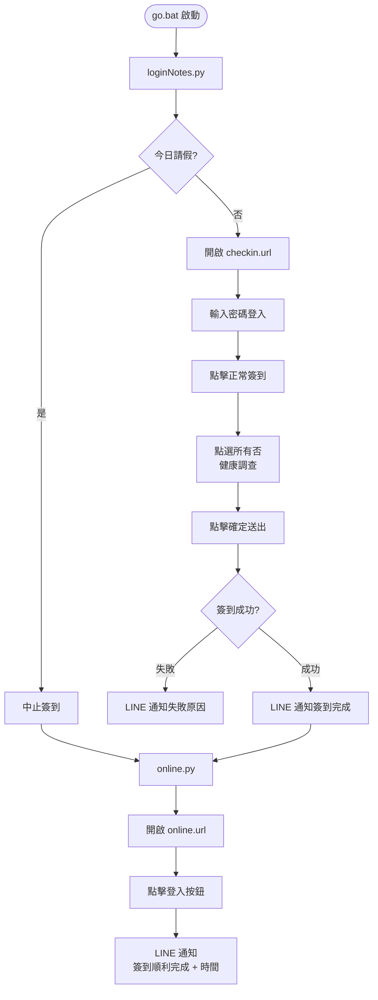

# autoRPA — Lotus Notes 自動簽到機器人

利用電腦視覺與 GUI 自動化技術，每日自動完成 Lotus Notes 簽到、健康調查填答、線上系統登入，並於完成後透過 LINE 推播通知結果。

---

## 功能特色

- **自動簽到** — 開啟 Lotus Notes 簽到表單，自動登入並完成正常簽到
- **健康調查自動填答** — 找出畫面上所有「否」選項並批次點擊
- **線上系統自動登入** — 簽到完成後自動開啟線上系統並點擊登入
- **LINE 推播通知** — 流程結束後傳送通知至 LINE，成功或失敗皆會告知
- **請假日自動跳過** — 讀取 `leave.csv`，遇假日自動中止簽到（線上系統仍正常執行）
- **失敗自動中止** — 簽到失敗時不繼續執行後續步驟，並推播失敗原因
- **安全憑證管理** — 密碼與 Token 存於 `.env`，不寫入程式碼或版本控制
- **無聲背景執行** — 透過 `run_hidden.vbs` 靜默啟動，不彈出視窗

---

## 執行流程



---

## 環境需求

| 項目 | 版本 |
|------|------|
| Windows | 10 / 11 |
| Python | 3.10 以上 |
| Lotus Notes | 已安裝於本機 |

---

## 安裝步驟

**1. 建立虛擬環境並安裝套件**

```bash
python -m venv venv
venv\Scripts\activate
pip install pyautogui opencv-python pyscreeze python-dotenv requests
```

**2. 建立 `.env` 檔案（放在專案根目錄）**

```
NOTES_PASSWORD=你的Lotus Notes密碼
LINE_CHANNEL_TOKEN=你的LINE Messaging API Channel Access Token
LINE_USER_ID=你的LINE User ID（U開頭的字串）
```

> `.env` 已加入 `.gitignore`，不會被推送至遠端。

**3. 設定 LINE Messaging API**

1. 前往 [LINE Developers Console](https://developers.line.biz/)
2. 建立 Messaging API Channel
3. 至「Messaging API」分頁，掃描 QR Code 將官方帳號加為好友
4. 產生 Channel Access Token，填入 `.env`
5. 至「Basic settings」分頁取得你的 User ID，填入 `.env`

---

## 使用方式

| 方式 | 說明 |
|------|------|
| 雙擊 `go.bat` | 依序執行兩支腳本（顯示視窗） |
| 雙擊 `run_hidden.vbs` | 靜默背景執行，不顯示視窗 |
| `python loginNotes.py` | 單獨執行簽到（開發測試用） |
| `python online.py` | 單獨執行線上登入（開發測試用） |

搭配 **Windows 工作排程器** 設定每日定時觸發 `run_hidden.vbs`，即可達成全自動排程。

---

## 設定請假日

在 `leave.csv` 中，每行填入一個請假日期（格式：`YYYY/MM/DD`）：

```
2026/01/01
2026/02/28
```

請假日當天，`loginNotes.py` 會自動中止不簽到，但 `online.py` 仍會繼續執行。

---

## 專案結構

```
autoRPA/
├── loginNotes.py       # Lotus Notes 自動簽到腳本
├── online.py           # 線上系統自動登入腳本
├── detect.py           # 滑鼠座標偵測工具（校準用）
├── go.bat              # 主啟動批次檔
├── run_hidden.vbs      # 靜默啟動腳本
├── leave.csv           # 請假日期清單
├── checkin.url         # Lotus Notes 簽到表單捷徑
├── online.url          # 線上系統網址捷徑
├── password_box.png    # UI 圖片：密碼輸入框
├── check.png           # UI 圖片：正常簽到按鈕
├── no.png              # UI 圖片：健康調查「否」按鈕
├── submit_btn.png      # UI 圖片：送出確定按鈕
├── login-online.png    # UI 圖片：線上系統登入按鈕
├── .env                # 機密設定（不納入版控）
└── venv/               # Python 虛擬環境
```

---

## 替換 UI 圖片

若介面更新導致辨識失敗，重新截圖替換對應 PNG：

1. 執行 `detect.py` 確認目標元素的螢幕位置
2. 使用截圖工具（剪取與草圖 `Win + Shift + S`）截取目標
3. 截圖須包含按鈕本身及四周至少 10px 留白
4. 覆蓋舊的 PNG 檔案，檔名保持不變

---

## 安全機制

| 機制 | 說明 |
|------|------|
| Failsafe | 執行中將滑鼠移至螢幕左上角 (0, 0) 可立即中止程式 |
| 逾時保護 | 每個步驟設有 10–60 秒逾時，避免無限等待 |
| 信心閾值 | 圖片比對需達 85–90% 相似度才執行點擊，防止誤觸 |
| 失敗中止 | `loginNotes.py` 任一步驟失敗時以結束碼 1 退出，`go.bat` 不繼續執行 `online.py` |
